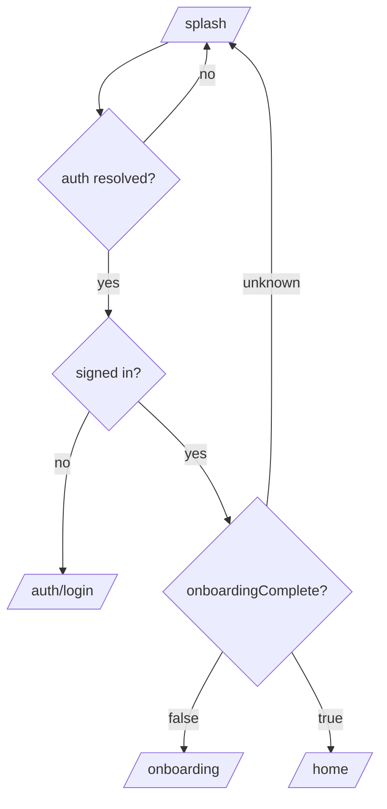

# Neko — Architecture

A concise map of how the app is put together. Neko uses a **feature-first**
layout: each feature owns its models, data (repositories), providers, and UI.

## Layers

```
UI (screens + widgets)
        │  watches AsyncValue / state
        ▼
Providers (Riverpod: notifiers + derived providers)
        │  call
        ▼
Repositories (throw AppException only)
        │
        ▼
Firebase (Auth · Firestore · Storage)
```

- **UI** reads `AsyncValue` and renders loading / data / error — it never
  performs auth navigation or catches repository errors directly.
- **Providers** orchestrate state and surface failures (as `AsyncError` or a
  state field).
- **Repositories** translate Firebase failures into `AppException` so no
  Firebase type leaks past the boundary.

## Folder structure

```
lib/
├── app/                     # App shell, theme tokens, router
│   ├── theme/               # AppColors, AppTextStyles, AppTheme
│   ├── router.dart          # GoRouter + RouterNotifier (auth redirect)
│   ├── routes.dart          # Route path constants
│   └── neko_app.dart        # MaterialApp.router
├── core/
│   ├── errors/              # AppException
│   ├── providers/           # firebaseAuth/firestore/storage, authState, currentUser
│   └── utils/               # logger, validators, TimestampConverter
├── features/
│   ├── auth/                # data / providers / ui (splash, login, register)
│   ├── onboarding/          # models, data, providers, ui (welcome + 6 steps)
│   ├── profiles/            # data, providers, ui (home, banners, nav pill)
│   └── settings/            # ui (sign out)
└── shared/
    ├── motion/              # springs, staggered entrance, page transitions
    └── widgets/             # NekoPillButton, NekoTextField, Pressable, ...
```

## Auth + onboarding gating (single source of truth)

`RouterNotifier.redirect` is the only place that gates routes. It listens to
two providers and re-evaluates on every change:



- `authStateChangesProvider` — `FirebaseAuth.authStateChanges()` stream.
- `onboardingCompleteProvider` — streams `users/{uid}.onboardingComplete`.

The final onboarding step writes the cat document **and** flips
`onboardingComplete` to `true` in a single Firestore batch, so the redirect
fires automatically and the user can never land between states. The
`/onboarding` route stays reachable when complete, so a returning user can add
another cat.

## Firestore schema

```
users/{uid}
  ├─ displayName: string
  ├─ email: string
  ├─ createdAt: timestamp
  ├─ onboardingComplete: bool
  └─ cats/{catId}
       ├─ name: string
       ├─ breed: string
       ├─ ageMonths: int
       ├─ weightKg: double
       ├─ colorType: string      // ginger | black | white | tabby | ...
       ├─ activityLevel: string  // couch | active | outdoor
       ├─ birthday: timestamp?
       ├─ dailyCalorieTarget: int
       └─ createdAt: timestamp
```

## Code generation

Riverpod providers (`@riverpod`) and Freezed models generate `*.g.dart` and
`*.freezed.dart`. After changing any of them:

```bash
dart run build_runner build --delete-conflicting-outputs
```
