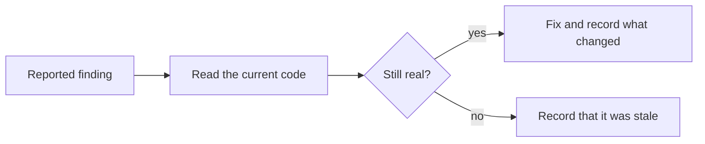

# Neko — Issue Fixes

This is the companion to the issues log. For each item there, I went back to the
current code, checked whether the problem was still real, and recorded what I
actually changed. Some findings were stale by the time I got to them; some
needed a real fix; a few I decided to leave alone on purpose, and I say why.
Everything below is against the code as it stands now, not the report text.

## Contents

- [1. Security (Aikido)](#1-security-aikido)
- [2. Static Analysis (SonarQube)](#2-static-analysis-sonarqube)
- [3. Build and environment](#3-build-and-environment)
- [4. Design system and UX debt](#4-design-system-and-ux-debt)
- [5. Notch](#5-notch)
- [6. Decisions that were still open](#6-decisions-that-were-still-open)

---

## 1. Security (Aikido)

**Chat history leaking across accounts on one device.** This was real. History
was stored under one shared key, so a second account signing in on the same
phone could read the first account's transcripts. I namespaced every key by the
Firebase UID (`chat_history_v1_<uid>`), made the provider rebuild on auth change
so it only ever reads the signed-in user's history, purged the old un-namespaced
key on sight, and cleared the user's key on sign-out. I also reset the active
in-memory conversation when the account changes, because otherwise the open chat
survived the sign-out and could be written back under the next account.

**Email enumeration on sign-up.** The register error for an already-registered
email was distinct enough to probe with. I softened it to a generic message that
doesn't confirm whether the email exists. This reduces the signal but doesn't
fully close it.

> [!IMPORTANT]
> Firebase's own email-enumeration protection is a console setting, which is the
> real fix and is a manual step, not something I can do from the code.

**Chat content leaking into logs on a bad AI response.** When the AI proxy
returned something that failed JSON parsing, the raw body (which can contain the
message text) was being logged. I gated the full detail behind `kDebugMode` in
both the streaming and non-streaming parse paths, so a release build only logs
the exception type, never the body.

**AI proxy token shipped in the app.** The token was being bundled because `.env`
was listed as a Flutter asset — anyone could unzip the APK and read it. I dropped
`flutter_dotenv`, removed `.env` from the assets, and moved all config to
compile-time values injected with `--dart-define-from-file=.env` (see
`lib/core/config/app_env.dart`). The raw file no longer ships. This reduces the
exposure but doesn't eliminate it: a compile-time constant can still be pulled
out of a decompiled binary. Fully removing it would mean a server-side relay that
holds the key and checks a Firebase token before forwarding, which is more than a
same-day change.

> [!CAUTION]
> Rotating the current token is a manual step on the Hack Club dashboard — I left
> that to be done by hand, since it's a credential change.

**BootReceiver accepting spoofed broadcasts.** The receiver was exported, so any
app could send it `QUICKBOOT_POWERON` and kick off the overlay restore. I set
`android:exported="false"`. Real boot broadcasts still reach a non-exported
receiver, so the notch still restores after a genuine reboot, but another app
can't trigger it anymore. I also tightened the gate so the restore only runs when
the notch is actually enabled, not off leftover state.

**Path traversal in local storage.** Document filenames were used to build
on-disk paths without being reduced to a safe basename. I added `_safeId` (for
the cat/type folder segments), `_safeName` (strips any directory parts and
dot-only names off a filename), and `_isInsideRoot` (confirms a resolved path is
still under the app's own storage folder before any delete). The human-readable
name is kept only as metadata now.

**SSL / cleartext traffic.** There was no explicit policy. I added
`android:usesCleartextTraffic="false"` and a `network_security_config.xml` that
trusts only the system store and permits no cleartext. There was no custom
certificate-bypass code anywhere (I grepped for `TrustManager`,
`HostnameVerifier`, `badCertificateCallback` and found none), so the finding was
about the missing policy, not a bad override.

**Android backup configuration.** The app stores vet documents and chat history
locally, so I set `android:allowBackup="false"` and added a
`data_extraction_rules.xml` that excludes app data from both cloud backup and
device-to-device transfer.

**kotlin-stdlib deserialization flag.** This was a transitive-dependency version
concern, not app code. The project's own Kotlin is 2.2.20, past the flagged CVEs,
so I forced `kotlin-stdlib` to 2.2.20 in the resolution strategy so no older
version can be dragged in. The app doesn't do Java deserialization of untrusted
input anywhere.

**Exported components in general.** I audited every activity, service, and
receiver. `MainActivity` stays exported — it's the launcher, which has to be. The
overlay services and notification listener were already `exported="false"` (the
listener is additionally guarded by the system's notification-listener
permission). The only genuinely wrong one was `BootReceiver`, covered above.

---

## 2. Static Analysis (SonarQube)

**Release obfuscation.** R8 shrink and obfuscation are on for the release build
(`isMinifyEnabled = true`, `isShrinkResources = true`, with a `proguard-rules.pro`).
For the Dart layer, the release build command uses
`--obfuscate --split-debug-info=build/debug-symbols`; that command is documented
in the README, and the symbols directory stays out of the repo.

**Hardcoded version numbers in gradle.** I pulled the native dependency versions
into named constants at the top of `android/app/build.gradle.kts` and referenced
them from one place instead of repeating literals.

**Backup / cleartext manifest lines.** Covered in section 1 (both fixed).

**Empty code blocks in the Kotlin (notch) files.** These were mostly intentional
empty catch blocks for best-effort operations. I went through each one and either
filled it with a one-line comment explaining why it's empty (e.g. the session
died between tap and dispatch, so a lost button press is the right outcome) or
collapsed dead scaffolding. None are left bare.

**Cognitive complexity over the limit.** In `NekoNotificationListenerService.kt`
I pulled the notification-parsing method apart into `resolveTitle`,
`resolveBody`, `resolveCategory`, `resolveProgress`, and `isCountdown`. In
`NotchBridge.kt` I split the command builder into `notificationCommand` and
`mediaCommand`. Both are under the threshold now, and the behaviour is unchanged
(same build passes, same events produced).

**Deprecated API.** The deprecated `URL(String)` constructor in the album-art
fetch became `URI(uri).toURL()`.

**Merged nested `if`.** Done in the notification-ignore check.

**Commented-out code in the launch backgrounds.** Removed from both the default
and v21 variants. The one comment that remains is a plain description of what the
file is, not dead code.

**Gradle task group/description and rootProject.name.** The `clean` task now has a
`group` and `description`, and `rootProject.name` is set in
`android/settings.gradle.kts`.

**Dependency lockfile.** This one is worth explaining, because a lockfile was
added at one point and it broke the build. A gradle lockfile pins the Flutter
engine artifact (`io.flutter:*_debug:1.0.0-<hash>`), and that hash is tied to the
exact Flutter SDK version on whoever generated it. On any other machine — a
teammate's, or a judge's — the locked artifact doesn't resolve and the build
fails outright. A portable lockfile isn't possible for a Flutter app for this
reason. I removed the locking and deleted the lockfile so the build works across
machines again. The SonarQube "lockfile missing" note is a false positive here
and should be marked won't-fix in the scanner rather than "fixed" with a file
that breaks the build.

**iOS / web / desktop platform folders.** This ships as an Android app, so the
iOS, web, Windows, macOS, and Linux folders were unused scaffolding generated by
`flutter create`. That's where the `SceneDelegate.swift` empty-class finding, the
`web/index.html` lang-attribute finding, and the whole cluster of C++/Swift style
findings came from. I deleted all of those folders. The findings are gone because
the files they pointed at are gone, and the app is smaller and less confusing to
read. The Dart platform-switch cases that mention iOS are harmless — they never
run on Android and don't need the folder.

---

## 3. Build and environment

**The "SDK not found" wall of errors.** Every Flutter type showed as unresolved
across dozens of files at once. This wasn't the code — `flutter analyze` from the
terminal returned clean at the same time. It was a stale Dart analysis server. The
fix was `flutter pub get` and restarting the analysis server, not touching any
code. I'm noting it here so it isn't mistaken for a real regression next time.

**The `rive` build failure.** The `rive` plugin pinned an old `minSdkVersion` that
conflicted with the NDK, and it wasn't actually being used yet (the mascot was
still a PNG). Removing the dependency cleared the build. Same lesson later with
`flutter_tts`, which was declared but unused after the text-to-speech path was
dropped — I removed it too.

**Firebase auth not enabled.** Email/password and Google sign-in both failed with
"sign-in provider is disabled." That's a Firebase console setting, not a code bug.
It needs the providers turned on in the console, and it needs everyone building
against the same `google-services.json`. Both are manual, off-code steps.

**Auth not tested end-to-end.** Screens were being iterated without running the
full login → onboarding → home flow live, which is how the console issue above
went unnoticed for a while. Worth doing a real device run of the whole path
before recording the demo.

---

## 4. Design system and UX debt

**Raw values instead of tokens.** The "30+ files" number was mostly stale by the
time I checked. When I re-ran the grep against the current code, almost all of the
raw `Duration`s were functional timing (retry delays, recognizer timeouts, the
snackbar display duration, timer scheduling) that shouldn't be a motion token at
all, or documented exceptions (page-transition curtains, the shimmer, typing
dots, the coach-mark tour, the paw drift, and the notch's own separate motion
system with its own tuned curve). The genuinely-wrong animation values I found —
the breed-step search field and chips, a document type-chip — I routed through
`NekoMotion`. Hardcoded colors were all intentional data (the avatar and coat
palettes, transparent system bars, the fixed tour scrim), not theme drift.

**`speech_to_text` assumed unused.** This came up twice as "dead dependency."
It's not — it's the backbone of the Hey Neko voice feature (wake word and
tap-to-talk). I confirmed the import is live and left it in. `flutter_tts`, on the
other hand, really was unused after the spoken-reply path was dropped, so I
removed that one.

**Welcome-screen paw looked like a blob.** The paw art was being drawn with a
solid color tint, which repaints every pixel one flat color and collapses the toe
beans, pad, and outlines into a shapeless shape. I dropped the tint so the paw
shows in its natural colors with the black outlines separating the toes, and it
reads as a paw again.

---

## 5. Notch

**Touch detection vs. footprint.** The minimized pill is its own overlay window,
and the tap target had shrunk to about 43dp — right at the edge of reliable
touch, which is what the reactivation problem was. The flag was already
interactive when an activity is present, so taps weren't being dropped for the
wrong reason. I enlarged the minimized window to clear the 48dp target
comfortably; the visible pill only grows slightly and stays unobtrusive. This is
the "slightly larger tap target" tradeoff rather than the voice-only workaround.
The voice trigger also exists as a second way in.

**Closed-state styling.** This is finished. The island is cat-themed through
`NotchThemeMapper`, which maps the active coat palette onto an always-dark island,
and the sizing, animation timing, and spacing have been tuned. Ongoing activities
(music, timers, calls, navigation) stay pinned instead of receding, and
navigation expands into a small map-styled card.

---

## 6. Decisions that were still open

**Search proxy 422.** I hit the endpoint directly with the actual key to settle
this. It returns `SUBSCRIPTION_TOKEN_INVALID` from the authentication component,
identical with both the `Bearer` and `X-Subscription-Token` header styles, which
means the request shape is correct and the token itself is being rejected
upstream by Brave. It's not something I can fix from the client. The feature
already degrades cleanly: a results-style query always offers a one-tap browser
search that opens Google, and the in-app result list only appears if a valid key
resolves. So there's no broken button to hide — I kept the browser fallback as
the working path.

**Notch touch detection.** Decided and implemented — enlarged tap target, above.

**Release signing.** The release build is intentionally debug-signed, because the
APK is side-loaded by judges rather than distributed through a store, so nothing
trusts that signature for anything privileged. I replaced the bare TODO in the
gradle file with a comment saying exactly that, and noting a production release
would need its own keystore. I left `applicationId` and `namespace` alone —
changing either without updating `google-services.json` to match would break the
Firebase config, and that's a manual call.

**ARCHITECTURE.md.** The team decided to consolidate documentation into the README
and remove the separate docs files, so I folded the security summary into the
README rather than pointing at a file that's being deleted.

**Submission packaging.** The README covers setup and how to sign in (email/
password with any address, or Google), with the correct build command including
the `--dart-define-from-file=.env` flag. The demo GIFs and project report are in
place.

---
