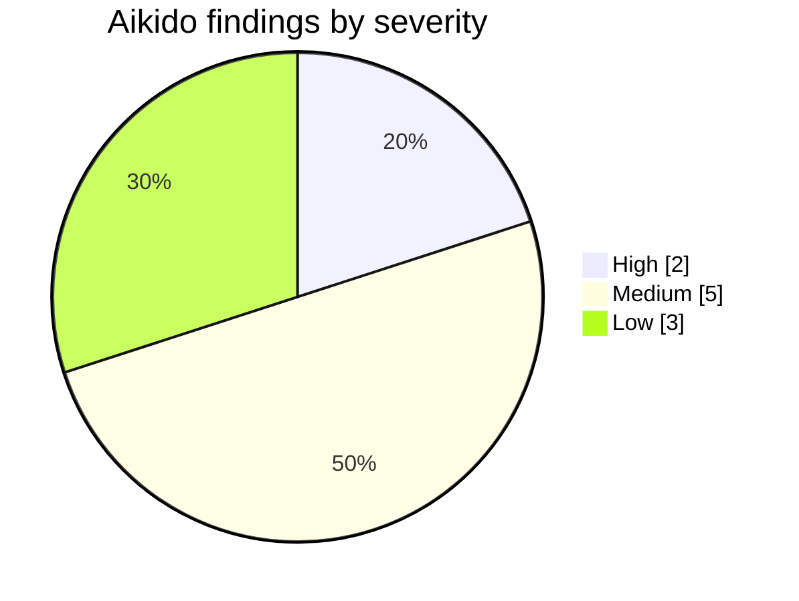

# Neko — Issues, Problems & Vulnerabilities Log

This is a full inventory of everything flagged or run into during the build: Aikido findings, SonarQube findings, and real problems hit during development (build failures, Firebase config, design debt, the notch touch-detection issue). Nothing here has been marked as fixed — some of this may already be resolved in the current codebase and some may not be. Before writing the fixes document, go through each item, check the actual code (grep it, read the file, confirm the line still says what the report says), and only then record what was actually done. Some of these reports were pulled at different times, so a few may already be stale.

## Contents

- [1. Security Findings — Aikido](#1-security-findings--aikido)
- [2. Static Analysis Findings — SonarQube](#2-static-analysis-findings--sonarqube)
- [3. Build & Environment Issues](#3-build--environment-issues-from-dev-sessions)
- [4. Design System & UX Debt](#4-design-system--ux-debt)
- [5. Notch-Specific Issues](#5-notch-specific-issues)
- [6. Open Decisions Still Pending](#6-open-decisions-still-pending)
- [7. Notes for Whoever Writes the Fixes Doc](#7-notes-for-whoever-writes-the-fixes-doc)

---

## 1. Security Findings — Aikido

### Sensitive data exposure

| Finding | Severity | Location | Detail |
|---|---|---|---|
| Global SharedPreferences chat history leaks saved transcripts across signed-in accounts on the same device | Medium | `lib/features/chat/providers/chat_history_provider.dart` | Chat history appears to be stored in a shared, non-namespaced key, so if a second account signs in on the same device it can read the previous account's chat transcripts. |
| Public sign-up flow exposes registered-email enumeration | Low | `lib/features/auth/ui/register_screen.dart` | The register flow likely returns a distinguishable error/response when an email is already registered, letting someone probe which emails exist in the system. |
| Malformed AI responses can leak chat content into production logs on JSON parse failure | Low | `lib/features/chat/data/chat_service.dart` | When the AI proxy returns something that fails JSON parsing, the raw response (which may include chat content) appears to get logged in production builds. |

### Hard-coded credentials

| Finding | Severity | Location | Detail |
|---|---|---|---|
| Client-shipped `.env` exposes a reusable AI proxy bearer token | Medium | `pubspec.yaml` | The Hack Club AI proxy token is a personal bearer token, not a shared community key, so if it's bundled into the shipped app/`.env` it's a real, usable credential exposure, not a scanner false positive. |

> [!CAUTION]
> The bundled proxy token needs a hard-stop manual rotation once removed from the client — **never have an agent auto-rotate this.**

### Insecure Android platform interaction

| Finding | Severity | Location | Detail |
|---|---|---|---|
| Exported `BootReceiver` accepts spoofed `QUICKBOOT_POWERON` broadcasts and can re-trigger Neko's overlay restore flow | Low | `android/app/src/main/kotlin/com/example/neko/BootReceiver.kt` | Any app can send this broadcast to the exported receiver and cause the overlay restore logic to run without the device actually rebooting. |

### Additional master-list findings (not broken out individually above)

| Finding | Severity | Location | Detail |
|---|---|---|---|
| Path traversal attack possible | High | `local_storage_service.dart`, `document_repository.dart` | Needs checking for unsanitized file paths being built from user- or AI-derived input (e.g. document names) before reading/writing to disk. |
| Improper SSL certificate validation | High | `AndroidManifest.xml` (x2) and one other location | Likely tied to the cleartext traffic / network security config flagged separately by SonarQube below. |
| Unsafe deserialization can lead to remote code execution | Medium | `kotlin-stdlib` | Worth confirming whether this is a real usage pattern in the notch/notification Kotlin code or a transitive dependency false positive. |
| Android components with exported attribute active | Medium | `AndroidManifest.xml` | Likely overlaps with the intents-not-received-safely finding from SonarQube and the `BootReceiver` finding above. |
| Improper Android backup configuration | Medium | `AndroidManifest.xml` (x2 locations) | Overlaps with the SonarQube "backup of application data" finding below. |

---

## 2. Static Analysis Findings — SonarQube

### `android/app/build.gradle.kts`

| Line | Issue | Severity / Category |
|---|---|---|
| L37 | Obfuscation is not confirmed enabled in the release build config | High, Security |
| L57 | Hardcoded version number | Medium, Consistency/Maintainability |
| L60 | Hardcoded version number | Medium, Consistency/Maintainability |

### `android/app/src/main/AndroidManifest.xml`

| Line | Issue | Severity / Category |
|---|---|---|
| L21 | Backup of application data may not be safe (`allowBackup` not explicitly locked down) | Medium, Security |
| L21 | `usesCleartextTraffic` is implicitly enabled for older Android versions | Low, Security |
| L85 | Intents may not be received safely (exported component without proper guarding) — almost certainly the same surface as the Aikido "exported attribute" and `BootReceiver` findings above | High/Critical, Security |

### `NekoNotificationListenerService.kt`

| Line | Issue |
|---|---|
| L64, L79, L90, L384, L446 | Empty/unfilled code blocks — either dead placeholder code left in, or logic started and never finished |
| L98 | Cognitive complexity is 18, over the allowed 15 (Critical, needs refactor/extraction) |
| L215 | A nested `if` should be merged with its parent `if` |
| L391 | Deprecated API usage |

### `NotchBridge.kt`

| Line | Issue |
|---|---|
| L84, L120, L133, L145, L157, L202, L212, L222 | Empty/unfilled code blocks |
| L226 | Cognitive complexity is 17, over the allowed 15 |

### Launch backgrounds

| File | Line | Issue |
|---|---|---|
| `android/app/src/main/res/drawable-v21/launch_background.xml` | L7 | Commented-out code left in |
| `android/app/src/main/res/drawable/launch_background.xml` | L7 | Commented-out code left in |

### Gradle / build config

| Location | Issue | Severity |
|---|---|---|
| `android/build.gradle.kts` | No dependency lockfile (`gradle.lockfile` or `verification-metadata.xml`), so dependency versions aren't pinned/predictable | Major, Security |
| `android/build.gradle.kts` L26 | A Gradle task is missing a `group` and `description` | — |
| `android/settings.gradle.kts` | `rootProject.name` is not assigned | — |

### iOS / Web

| File | Line | Issue |
|---|---|---|
| `ios/Runner/SceneDelegate.swift` | L4 | Empty class with no implementation and no protocol conformance explaining why it's empty |
| `web/index.html` | L2 | Missing `lang`/`xml:lang` attribute on `<html>`/`<body>` (accessibility/WCAG2-A, flagged as a Bug) |

Cross-platform runner boilerplate (Windows / Linux / macOS)

These are the default Flutter-generated desktop runner files (`windows/runner/*`, `linux/runner/my_application.cc`, `macos/Runner/AppDelegate.swift`, `macos/Flutter/GeneratedPluginRegistrant.swift`). Since Neko ships as an Android app for the hackathon, these desktop targets are probably out of scope for actual fixes, but they're still part of the SonarQube report and worth a documented decision (fix, suppress from the scan, or explicitly note as out-of-scope/unused platform targets) rather than silently ignoring them. The flagged issues are mostly C++/Swift style rules: redundant type usage instead of `auto`, `reinterpret_cast` used where a safer cast would do, raw `new` instead of RAII, missing `nullptr` literal usage, non-const globals, macros that should be `const`/`constexpr`/`enum`, an unused-parameter warning, a non-virtual-safe destructor call pattern, and a case-sensitivity issue in a `#include` path for `Windows.h`.

---

## 3. Build & Environment Issues (from dev sessions)

- **Phantom "SDK not found" wall of errors.** At one point every Flutter type (`Color`, `FontWeight`, `Offset`, `VoidCallback`) and even `dart:ui` itself showed as unresolved across 30+ files simultaneously. This looked like broken code but was actually a stale Dart Analysis Server / desynced IDE state (confirmed by `flutter analyze` returning "No issues found" with exit code 0 from the terminal at the same time). Fixed by running `flutter pub get` and restarting the Dart Analysis Server, not by touching any code.
- **APK build failure from the `rive` package.** The `rive` plugin declared `minSdkVersion 19`, and NDK 28 dropped support for anything below API 19/21, so the build died during native compilation. There was no actual `.riv` animation file in use yet (the mascot was still a PNG placeholder), so this was a real blocker with no code-quality upside to keep the dependency around at that point.
- **Firebase Authentication not enabled in console.** Email/password and Google sign-in both returned "this operation is not allowed... sign-in provider is disabled for this Firebase project" — a console configuration gap, not a code bug. Needed the relevant providers toggled on in Firebase Console → Authentication → Sign-in method.
- **Shared Firebase project access.** Needed to be added as an Editor on the shared Firebase project, and needed to confirm both teammates were using the same `google-services.json` (risk of one person building against a stale/placeholder config).
- **Auth flow not actually tested end-to-end during screen development.** Screens were being reviewed/iterated without ever running the full login → onboarding → home flow live on device, which is how the Firebase provider issue above went unnoticed for a while.

---

## 4. Design System & UX Debt

- **Token system bypassed in 30+ files.** A sweep found 30+ files using raw `Duration`, `Curves`, hardcoded colors, or hardcoded spacing values instead of going through `NekoMotion`, `NekoColors`, and `NekoSpacing`/`AppSpacing`. This breaks the "token system is law" rule and creates visual/motion inconsistency across screens that were built at different times.
- **`speech_to_text` was assumed to be an unused dependency** in an earlier pass, when it's actually wired into a real, built-out voice feature with wake-word detection. Treating it as dead weight would have been a wrong fix based on a stale assumption rather than checked evidence.

---

## 5. Notch-Specific Issues

- **Touch detection vs. footprint tradeoff.** If the notch overlay is kept small enough to feel unobtrusive (like the iOS Dynamic Island), it doesn't reliably register touch input. If it's made large enough to detect touch reliably, it either takes up too much screen space or visually doesn't sit right against the Android status bar/cutout. No workaround had been found as of the last design discussion — the working theory floated was activating it without relying on direct touch (e.g. a voice trigger) rather than solving touch detection at the current size.
- **Notch closed-state styling was still unfinished** — sizing, animation timing, and spacing needed more work, and the color palette hadn't been made cat-themed yet (was still using placeholder/generic colors at the time).

---

## 6. Open Decisions Still Pending

- [ ] **Search proxy 422 error** from `search.hackclub.com` — undecided whether to actually fix the underlying request/response handling or hide the feature for submission.
- [ ] **Notch touch detection tradeoff** — see above, no concrete decision locked in yet.
- [ ] **`docs/ARCHITECTURE.md` missing** — needed for the Documentation scoring category in judging.
- [ ] **Release signing config** — still a TODO, needed before a real release build can be produced/submitted.
- [ ] **Submission packaging** — `source/` and `documentation/` folders, root `README.md`, and the demo video/project report still need to be assembled per the official hackathon submission rules.

---

## 7. Notes for Whoever Writes the Fixes Doc

> [!IMPORTANT]
> Don't assume any item above is already fixed just because it appears in a report — confirm against the current file contents first (theory → evidence → fix).

- Where multiple findings point at the same underlying surface (e.g. the exported-component / intent / `BootReceiver` cluster, or the SSL/cleartext-traffic cluster), it's fine to document them as one fix if that's what actually happened.
- The desktop runner boilerplate (section 2, last item) needs an explicit decision recorded either way — fixed, suppressed, or marked out of scope — rather than left unaddressed with no note.

> [!TIP]
> Keep the fixes doc itself in plain, direct language — what the problem actually was, what was found when it was checked, and what was changed. No filler, no marketing tone, no emojis.
