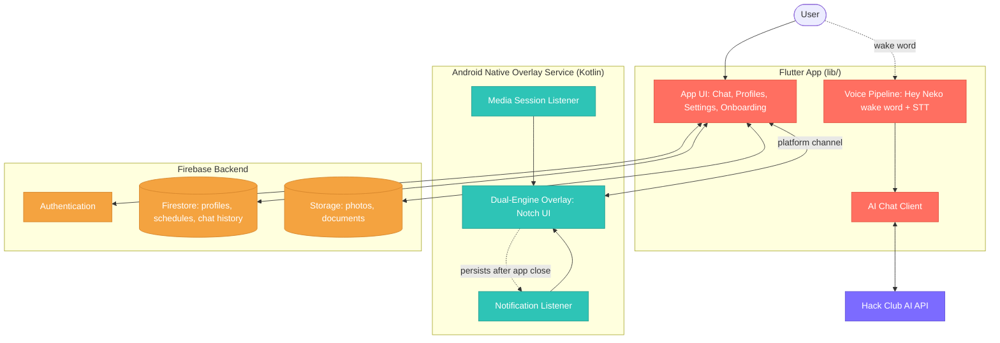
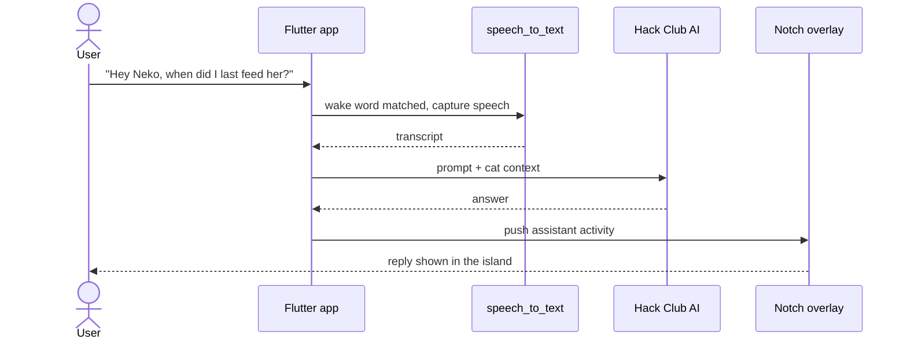
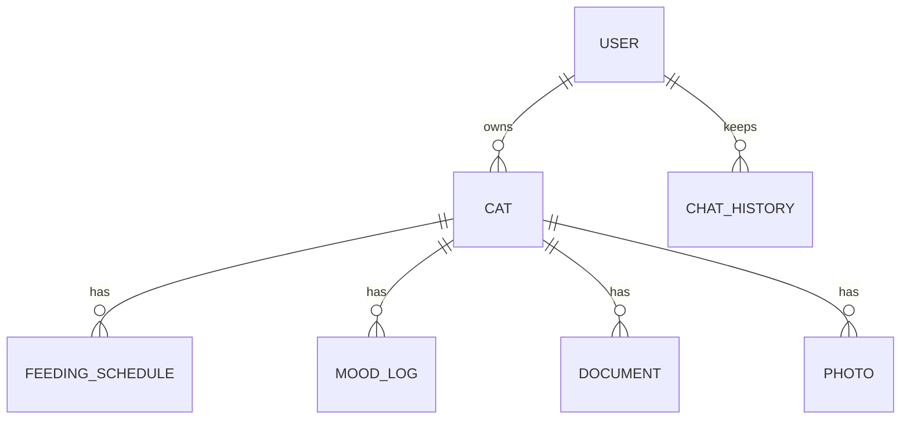
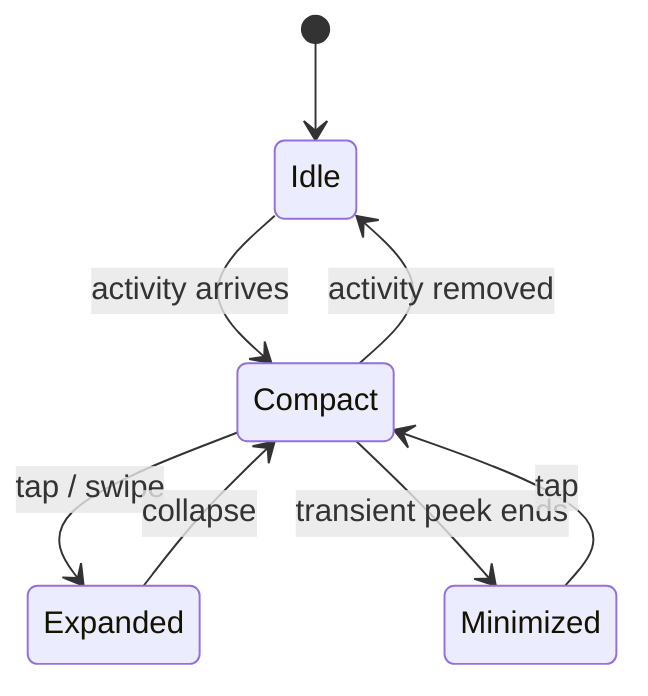
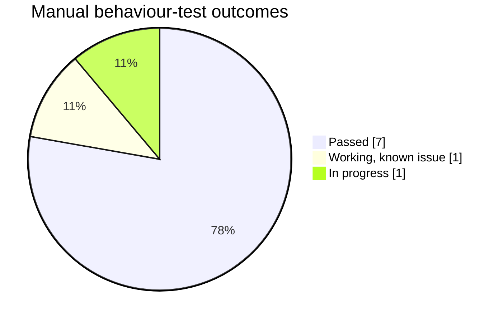

# Neko Project Report

## Contents

- [1. Project Overview](#1-project-overview)
- [2. Technology Stack](#2-technology-stack)
- [3. Technical Architecture](#3-technical-architecture)
- [4. Testing Matrix](#4-testing-matrix)
- [5. Tools Used](#5-tools-used)

---

## 1. Project Overview

### a. Why we're building this

You don't remember to check a cat-care app, you remember when your phone lights up. That's the gap Neko starts from, feeding schedules to vet records exist as apps you have to *go find*, so they get ignored until something's already wrong. iPhone users have had a Dynamic Island quietly surfacing what matters for years; Android has nothing like it, and nothing built for pet owners at all. So instead of building another tracker to forget about, we put the cat on screen, always, a live Notch that never gets hidden away, and gave it a voice, so "Hey Neko, when did I last feed her?" gets answered on the spot instead of buried three taps deep in a menu.

### b. How it relates to the theme

This fits #HackTheKitty because its two flagship features are literally an AI and a Dynamic-Island-style Notch, the app is built around a persistent, cat-branded overlay (something Android doesn't have natively) driven by a conversational AI voice assistant, not a checklist app with a cat icon slapped on it.

---

## 2. Technology Stack

| Technology | Used For | Why This Choice |
|---|---|---|
| **Flutter / Dart** | Core cross-platform app framework (UI, state, navigation) | Single codebase targets Android, iOS, and desktop from one source tree|
| **Firebase Authentication** | User sign-in (Google Sign-In) | Managed auth without standing up a backend |
| **Cloud Firestore** | Storing cat profiles, feeding schedules, chat history, mood logs | Real-time sync and managed NoSQL store, no server to run |
| **Android Native Overlay Service (Kotlin)** | Powers the Dynamic-Island-style "Notch" that stays alive after the app is closed | Flutter alone can't draw a persistent system-level overlay outside the app's window — this required dropping into native Android via platform channels |
| **AI API (HackClub AI API)** | Drives the AI chat companion and the "Hey Neko" voice assistant | Configured via `.env` (`AI_API_KEY`), kept out of source control |
| **Lottie** | In-app cat animations and mood states | Lightweight vector animations instead of shipping video/gif assets |
| **Material 3** | Component/design system | Consistent theming with minimal custom widget work |

---

## 3. Technical Architecture

Neko is really two cooperating runtimes: the main Flutter app the user sees, and a native Android overlay service that keeps the "Notch" alive independently of the app's lifecycle. They talk to each other over platform channels, and both ultimately read/write the same Firebase backend so state stays consistent whether you're looking at the in-app UI or the overlay.

**Walking through it:**

- **Flutter app (`lib/`)** is the primary surface, chat, cat profiles, onboarding, settings, almost everything lives here. It's also where the AI chat client and the voice pipeline (wake-word detection → speech-to-text → AI request) live.
- **Native Android overlay service** is a separate engine that draws the Notch UI over other apps and keeps running after the Flutter app is backgrounded or killed. It listens to system notification and media session events directly so it can show calls, music, and downloads without the Flutter app being in the foreground. Flutter and the overlay communicate over Android platform channels.
- **Firebase** is the shared source of truth — Auth gates access, Firestore holds structured data (profiles, feeding schedules, chat history, mood logs), and Storage holds photos and vet documents. Both the app UI and (indirectly, through the app) the overlay draw from this same backend, so a feeding timer set in the Notch reflects the same schedule stored in Firestore.
- **HackClub AI API key** is called from the Flutter side only, keyed via `.env`, and is the single dependency both the chat feature and the voice assistant route through.

### The "Hey Neko" voice flow

A spoken question is answered on the spot instead of buried three taps deep:

### The Firestore data model

Everything is scoped under the signed-in user; the security rules deny anything outside `users/{uid}`:

### Dynamic Island states

The overlay is a small state machine — idle until something happens, then a compact pill that can expand or step aside:

---

## 4. Testing Matrix

> [!NOTE]
> Neko does not have an automated unit/widget test suite covering app behavior. Validation was done manually against physical devices and emulators, tracked against the project's own working checklist. Below reflects what has been verified and what was still open as of the latest commit.

| Feature | How It Was Tested | Result |
|---|---|---|
| Feeding timers / countdowns | Manual test on Android device, app backgrounded during countdown | Passed — timer persists and surfaces in the Notch |
| Notch overlay (Dynamic Island) | Manual test on physical Android device (overlay requires real hardware, not reliably testable on emulator) | Working, but a known issue remains with the notch not fully closing/shutting down in all cases (open item at time of writing) |
| Cat profiles (create/switch multiple cats) | Manual walkthrough: add cat → switch profile → verify data isolation in Firestore | Passed |
| AI Chat | Manual conversation testing against the configured AI API key | Passed for core chat flow |
| Voice Assistant / "Hey Neko" wake word | Manual testing on-device, including background listening | In progress at time of writing — wake-word/background listening was still being finalized |
| Notifications & media mirroring in Notch | Manual test: trigger notification/music playback with app backgrounded, observe Notch | Passed |
| Google Sign-In / Auth | Manual sign-in/sign-out flow test | Passed |
| Photo capture & gallery sync | Manual test: capture photo, verify it appears in Firebase Storage and syncs across app restart | Passed |
| Onboarding flow | Manual walkthrough on fresh install | Passed |
| Static analysis / code quality | Automated scans (not app-behavior tests) via CodeRabbit, SonarQube, and Aikido | Scans planned/run as part of final polish pass, findings addressed before submission |

> [!IMPORTANT]
> Because the overlay and voice features depend on OS-level permissions and hardware (microphone, notification access, draw-over-other-apps), physical-device testing was prioritized over emulator testing wherever those features were involved.

---

## 5. Tools Used

Beyond the runtime tech stack, the following tools supported development, review, and shipping:

| Tool | Role |
|---|---|
| **Android Studio** | Primary IDE for Android-side native overlay development and device testing |
| **VS Code** | Used alongside Android Studio for Flutter/Dart work (`.vscode/` config in repo) |
| **Kiro** | Spec-driven development workflow (see `.kiro/specs/`), used for planning features such as page transition animations |
| **CodeRabbit** | Automated code review scans |
| **SonarQube** | Static code quality/analysis scanning |
| **Aikido** | Security scanning |
| **Cap** | Screen recording tool used for capturing the demo video |
| **Firebase Console** | Managing Authentication, Firestore, and Storage configuration |
| **Git/GitHub** | Version control and collaboration (126 commits across the team) |
