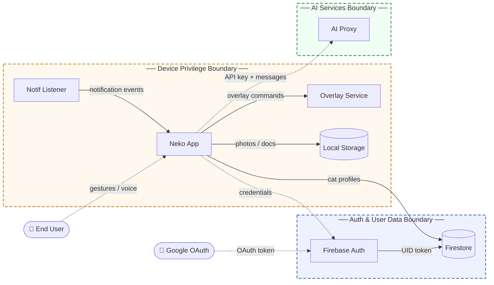
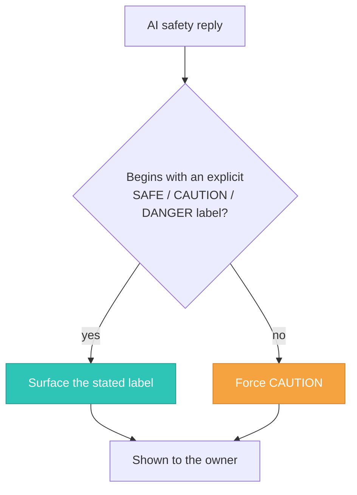

# Threat Model: Neko Cat Care Companion (Mobile App)

## Contents

- [1. Overview](#1-overview)
- [2. Trust Boundaries](#2-trust-boundaries)
- [3. Threat Scenarios](#3-threat-scenarios)
- [4. Architectural Fragilities](#4-architectural-fragilities)

## 1. Overview

Neko is a Flutter-based mobile application (Android and iOS) that helps cat owners manage pet profiles, store health records, and interact with an AI chat assistant for cat care advice. It also provides an Android Dynamic Island-style live-activity overlay ("Neko Notch") that mirrors device notifications, media playback, calls, navigation, and in-app timers onto the status bar. Backend services are Firebase Authentication and Cloud Firestore; AI inference is delegated to an OpenAI-compatible Hack Club proxy (Gemini model); all media files are stored on-device only.

Main components:

| Component | Role |
|---|---|
| Flutter mobile app | UI, routing, and all client-side logic |
| Firebase Authentication | Identity provider for email/password and Google OAuth |
| Cloud Firestore | Per-user cat profiles and health metadata (user-scoped) |
| Hack Club AI proxy | Streaming chat completions and vision-based cat safety scans |
| Hack Club/Brave Search API | Optional web search for voice queries |
| Android NotificationListenerService | Reads device notifications to feed the overlay |
| Android overlay service | Renders the live-activity pill over other apps using SYSTEM_ALERT_WINDOW |
| Local on-device storage | Cat profile photos and documents (Hive index + filesystem) |

This model covers the trust boundaries between the mobile client, Firebase services, and external AI and search APIs, with a focus on data access, authentication integrity, and the high-privilege Android capabilities the app requires.

## 2. Trust Boundaries

| Boundary | Trust assumption | Enforcement |
|---|---|---|
| **Auth Boundary** | The app trusts Firebase as the sole identity authority; Firebase ID tokens gate all authenticated operations. | Firebase Auth issues short-lived JWTs after credential verification; Firestore security rules reject any request whose `auth.uid` does not match the target document path. |
| **User Data Boundary** | The app trusts Firestore to enforce strict per-user isolation. | Security rules allow read/write only to `users/{uid}/**` where the UID matches the authenticated token subject; a catch-all deny rule blocks all other paths. |
| **AI Services Boundary** | The app trusts the Hack Club AI proxy to serve model completions in exchange for a valid API key. | A bearer API key is included in the Authorization header of every request; there is no user-identity check at the proxy level. |
| **Device Privilege Boundary** | The notification listener and overlay service trust Android to gate their elevated capabilities behind explicit user consent. | Android OS permission grants (notification access settings for the listener; SYSTEM_ALERT_WINDOW for the overlay). The app cannot activate either without the user completing the OS permission flow. |

## 3. Threat Scenarios

### Account takeover via credential reuse or phishing

An attacker who obtains a user's email and password (through credential-stuffing from a third-party breach or a phishing page) can sign in via the standard email/password flow and gain full access to the victim's account, including all cat profiles, health documents, and chat history. The auth boundary trusts that submitted credentials imply legitimate identity; there is no secondary verification to challenge that assumption.

| | |
|---|---|
| **Risk** | High likelihood, Medium impact |
| **Mitigation** | Enforce multi-factor authentication as an available or mandatory step for the email/password sign-in path to ensure credential knowledge alone is insufficient for account access. |
| **Validation** | Pentest: attempt sign-in with credential-stuffing payloads against test accounts and confirm MFA challenges are issued; automated test: verify that an account with MFA enabled cannot be signed into without the second factor. |

### AI prompt injection to manipulate cat safety verdicts

A user crafts text or image inputs designed to override the system prompt and induce the AI to label a dangerous substance (lilies, xylitol, onion, and the like) as SAFE in the cat safety scan flow. The AI Services boundary trusts that the model will honor the system prompt, but the system prompt is advisory and can be overridden by sufficiently adversarial user content.

> [!CAUTION]
> A falsely safe verdict could lead an owner to expose their cat to a lethal hazard.

| | |
|---|---|
| **Risk** | Medium likelihood, High impact |
| **Mitigation** | Enforce a client-side post-processing step that treats any safety scan response that does not begin with an explicit SAFE, CAUTION, or DANGER label as CAUTION by default, so a manipulated or ambiguous reply always falls back to the cautious outcome. |
| **Validation** | Pentest: submit a set of adversarial prompt injection payloads and images for known cat toxins and verify that no response is surfaced to the user as SAFE without the model explicitly producing that label. |

The client-side fail-safe in one glance — anything that is not an explicit label lands on CAUTION:

### AI API key extraction and unauthorized backend usage

The Hack Club AI API key is loaded from the app's bundled environment configuration at build time and is therefore present in the distributed APK and IPA packages. An attacker who decompiles the package can extract the key and make direct requests to the AI proxy without any connection to the app or to a specific user account. This allows unlimited AI queries, exhaustion of rate limits or token quotas, and potential cost impact on the service.

| | |
|---|---|
| **Risk** | High likelihood, Medium impact |
| **Mitigation** | Route all AI calls through a thin server-side proxy that validates a Firebase ID token before forwarding the request, removing the AI API key from the client bundle entirely and binding AI usage to authenticated identities. |
| **Validation** | Code review: confirm no API key strings are present in the compiled release binary (APK/IPA inspection); pentest: attempt to call the AI endpoint directly with only the extracted key and no valid Firebase token to confirm the proxy rejects unauthenticated calls. |

### Sensitive notification content persisted to shared storage

The notification listener forwards the title and body of every device notification (including messages from banking, health, and messaging applications) to the Flutter app, which stores a subset of ongoing activities in SharedPreferences to restore the overlay after reboot. An attacker with local access to the device's app data partition (via ADB on a USB-debugging-enabled device, a rooted device, or a backup extraction) can read persisted notification text that was never intended to be stored beyond immediate display.

| | |
|---|---|
| **Risk** | Low likelihood, Medium impact |
| **Mitigation** | Restrict the persistent overlay restore payload to structural metadata only (activity type, timer end timestamp, and app package identifier), excluding all notification title and body text from SharedPreferences writes. |
| **Validation** | Code review: audit every `_prefs.setString` call in the notch controller to confirm notification text fields are stripped before serialization; automated test: trigger an overlay restore cycle and assert that the restored SharedPreferences value contains no title or body content sourced from a notification event. |

## 4. Architectural Fragilities

**Client-direct Firestore writes with no server-side validation layer**

All Firestore mutations are executed directly from the mobile client using the Firebase SDK. There is no server-side application layer to enforce business invariants (field format constraints, maximum records per user, or immutable field protection beyond what the Firestore rules provide). The security rules correctly enforce UID-scoped access and prevent cross-user reads and writes, but they cannot enforce semantic constraints on the content of documents within the user's own tree. A modified client can write arbitrary field values or an arbitrarily large number of cat documents without rejection.

> [!WARNING]
> This creates a single enforcement layer: if the rules are ever relaxed or misapplied during a future feature addition, there is no secondary backstop to catch the regression before it reaches production data.
