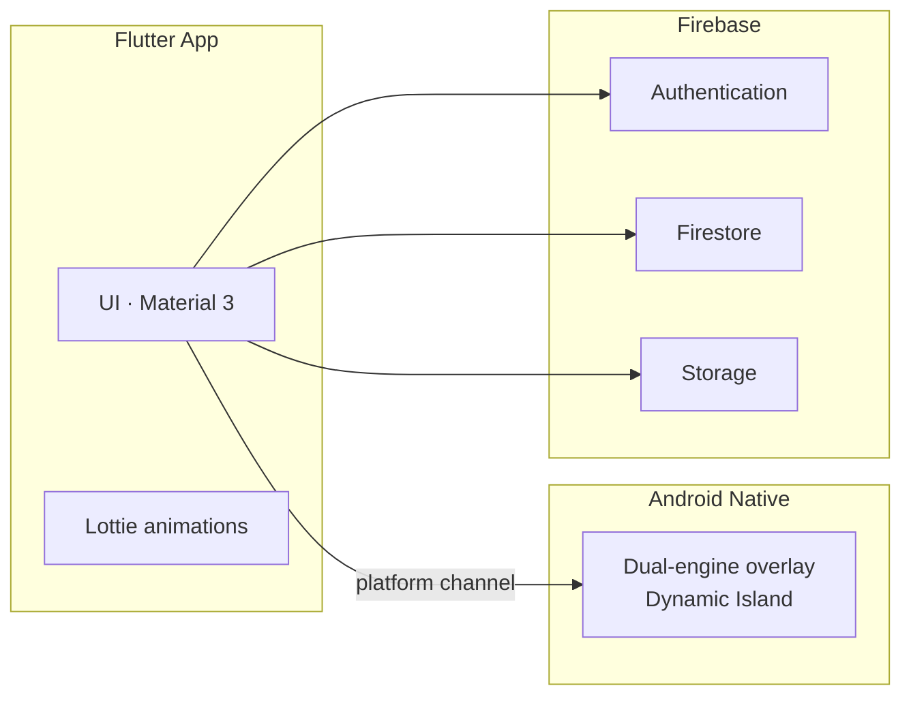

<h1 align="center">
  <br>
  
  <br>
  <br>
  Neko
  <br>
</h1>

<div align="center">

[](https://flutter.dev)
[](https://dart.dev)
[](https://firebase.google.com)
[](#prerequisites)
[](https://m3.material.io)

Neko is the purr-fect (and honestly, the only) cat owner companion app you'll need. Feeding schedules or vet records, all wrapped up with an AI cat companion and an Apple-inspired Dynamic Island overlay, because your cat deserves nothing less pawsome.

</div>

## Contents

- [Overview](#overview)
- [Features](#features)
  - [The Dynamic Island](#the-dynamic-island)
  - [Core Features](#core-features)
- [Tech Stack](#tech-stack)
- [Architecture at a glance](#architecture-at-a-glance)
- [Prerequisites](#prerequisites)
- [Running the Project](#running-the-project)
- [Configuration](#configuration)
- [Trying the headline features](#trying-the-headline-features)
- [Security](#security)

## Overview

Neko was born out of pure cat-astrophe, juggling five different apps just to remember feeding times or vet visits something was actually wrong. So this app was created to bring it all together in one meow-nificent place

## Features

### The Dynamic Island

Turns your phone's punch hole cutout into an always-on activity pill, Dynamic Island, but with claws.

| Live activity | What it surfaces |
|---|---|
| **Music Playback** | Album art, track info, playback controls |
| **Calls & Navigation** | Incoming calls, active directions, no cat-terruptions missed |
| **Downloads & Notifications** | Mirrors system notifications live |
| **Feeding Timers** | Countdowns so mealtime's never a cat-astrophe |
| **Voice Assistant** | Voice chat, right in the notch |

### Core Features

| Feature | What it does |
|---|---|
| **AI Chat** | Purr-sonal chats with full history |
| **Voice Recognition** | "Hey Neko" wake word, background listening |
| **Cat Profiles** | Purr-files for as many cats as you can herd |
| **Document Management** | Vet records, digital pet passports |
| **Photo Capture & Gallery** | Fur-tographs, synced via Firebase |
| **Guided Onboarding** | Duolingo-style walkthrough |
| **Animations** | Lottie cat states + custom NekoMotion transitions |
| **Settings** | Themes, sounds, feature toggles, Notch on/off |

<table align="center">
  <tr>
    <th>Cat Profile</th>
    <th>Adding a New Cat</th>
  </tr>
  <tr>
    <td></td>
    <td></td>
  </tr>
</table>
<table align="center">
  <tr>
    <th>AI Capabilities</th>
    <th>The Dynamic Island</th>
  </tr>
  <tr>
    <td></td>
    <td></td>
  </tr>
</table>
<table align="center">
  <tr>
    <th>Themes</th>
    <th>Voice Assistant</th>
  </tr>
  <tr>
    <td></td>
    <td></td>
  </tr>
</table>

## Tech Stack

| Technology | Role |
|---|---|
| **Flutter** | The framework holding this whole cat-tastrophe together |
| **Firebase** | Authentication, Firestore, and Storage |
| **Android native overlay service** | Dual-engine implementation powering the Dynamic Island |
| **Lottie** | In-app animations |
| **Material 3** | Component system |

## Architecture at a glance

The Flutter app is the main surface; a native Android overlay service draws the Dynamic Island and keeps it alive over other apps, talking to Flutter over a platform channel. Firebase is the shared backend for auth, data, and files.



## Prerequisites

Before you can let the cat out of the bag, make sure you have:

- **Flutter SDK** (3.x or later, Dart ≥ 3.11) — [installation guide](https://docs.flutter.dev/get-started/install)
- **Dart SDK** (included with Flutter)
- **Android Studio**, with:
  - Android SDK (API level 26 or higher; the app's minSdk is 24)
  - An emulator or physical Android device

> [!IMPORTANT]
> A physical Android device is strongly recommended for testing the Notch overlay — it depends on OS-level draw-over-other-apps behaviour that emulators don't reproduce reliably.

## Running the Project

1. Clone the repo, no cat-burglary required:
   ```sh
   git clone https://github.com/dhruvin-sarkar/Neko.git
   cd neko
   ```
2. Install dependencies:
   ```sh
   flutter pub get
   ```
3. Add your config (see [Configuration](#configuration) below): `android/app/google-services.json` and a `.env` file at the project root (copy `.env.example`).
4. Run the app on a connected device or emulator:
   ```sh
   flutter run --dart-define-from-file=.env
   ```

> [!TIP]
> Config is injected **at build time** via `--dart-define-from-file`, so it's never bundled as a readable file inside the APK. Always pass the flag — without it, the app starts without its configuration.

## Configuration

A few things need to be set up before the app will actually purr to life. Copy `.env.example` to `.env` and fill it in — every value is injected at build time by the `--dart-define-from-file=.env` flag above (nothing is read from a bundled asset at runtime):

| Configuration | Purpose | Where to set it |
|---|---|---|
| `google-services.json` | Firebase project credentials for Android | Place in `android/app/` (gitignored) |
| `HACKCLUB_API_KEY` | Powers the AI chat and voice assistant — free at <https://ai.hackclub.com/dashboard> | In `.env` |
| Google Sign-In | Required for Google auth | Enable in the Firebase console (Authentication → Sign-in method) and register your signing SHA-1 there. Email/Password works without this |
| Dynamic Island overlay permission | Enables the system-level overlay | Requested at runtime; toggle on/off in Settings (off by default) |
| Notification & microphone permissions | Notification mirroring + "Hey Neko" voice | Requested at runtime (both features off by default) |

## Trying the headline features

> [!NOTE]
> Both are **off by default** — each needs a sensitive permission, so the user opts in.

1. **Notch**: Settings → *Neko notch* → grant "Display over other apps" and Notification access. Play music or start a timer and watch the status bar.
2. **Hey Neko**: with the notch on, Settings → *Hey Neko voice* → grant the microphone. Say "Hey Neko" — a persistent notification shows whenever the mic is listening, on purpose.

## Security

> [!NOTE]
> No secrets in the repo or the APK — config is injected at build time via `--dart-define-from-file`, never bundled as a readable asset.

- **Firestore rules** (`firestore.rules`): each user can only reach their own `users/{uid}` tree; everything else is default-deny.
- **Hardening**: path-traversal hardening on local storage, per-account chat isolation, a locked-down manifest (HTTPS-only, backup-excluded, unexported receivers), and R8 + Dart release obfuscation round out the security pass.
- **Data handling**: chat transcripts are stored per account and cleared on sign-out; app data is excluded from Android backup and device-to-device transfer.

<div align='center'>

# Thanks fur checking out Neko!

</div>
